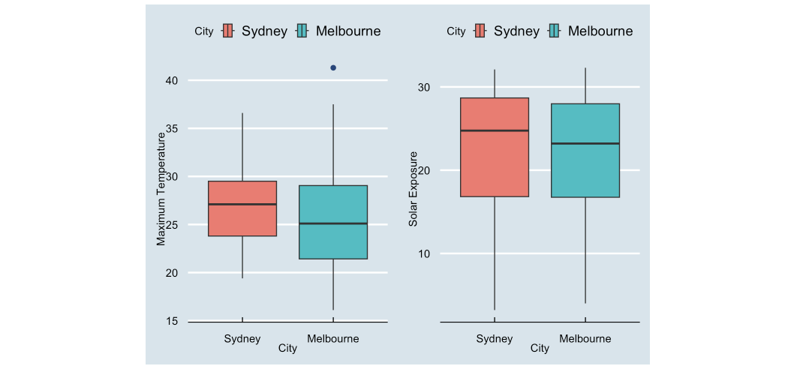
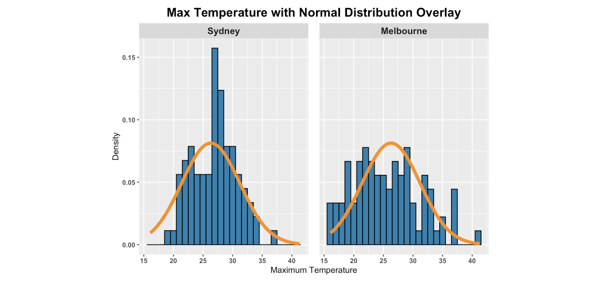
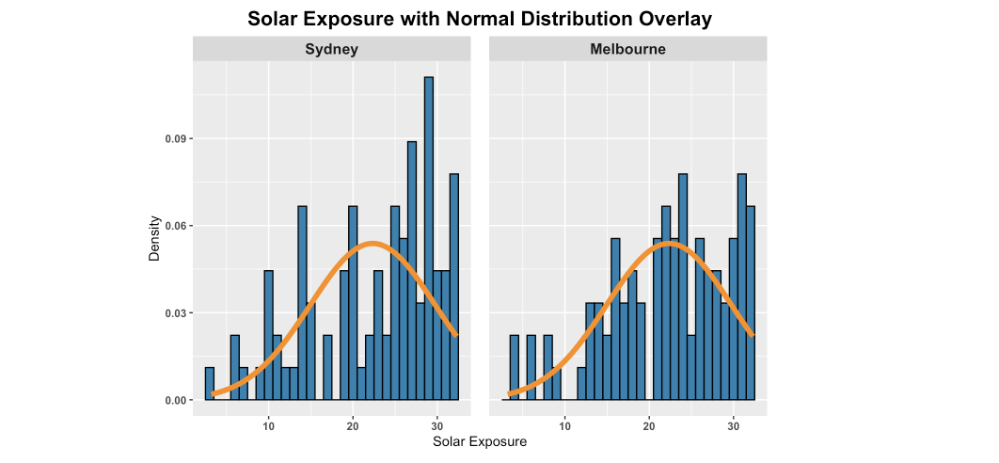

# Climate Harmony: Melbourne and Sydney 🌤️

## Introduction
This project involves the statistical analysis of climate data from the cities of Melbourne and Sydney. The primary goal is to gain insights into the relationship between two selected variables, namely Maximum Temperature and Solar Exposure. The investigation includes data preprocessing, exploratory data analysis, summary statistics, and distribution fitting.

## Problem Statement
The aim is to analyze the provided climate data sets for Melbourne and Sydney, focusing on any two variables among Maximum Temperature, Solar Exposure, and Wind Speed. The investigation involves exploring correlations, checking for normal distribution, and providing meaningful insights.

## Procedure
1. **Data Import and Preparation:** Imported and structured data sets for Melbourne and Sydney, ensuring compatibility.
2. **Variable Selection:** Chose Maximum Temperature and Solar Exposure based on a positive correlation observed in scatter plots.
3. **Summary Statistics:** Calculated descriptive statistics for the selected variables grouped by city, visualized through box plots.
4. **Distribution Fitting:** Compared the empirical distribution of variables with normal distribution using histograms.

## File Structure
- **WeatherTrendStatistics.Rmd:** R Markdown script containing code and analysis.
- **Climate Data Melbourne.csv:** Data file for Melbourne climate.
- **Climate Data Sydney.csv:** Data file for Sydney climate.

## Preview





## Dependencies
Ensure you have the following R packages installed:
- readr
- dplyr
- Hmisc
- ggplot2
- gridExtra
- viridis
- ggthemes
- psych

## How to Run
1. Open **WeatherTrendStatistics.Rmd** in RStudio.
2. Run each code chunk sequentially.

## Project Structure
```plaintext
.
├── WeatherTrendStatistics.Rmd
├── data
│   ├── Climate Data Melbourne.csv
│   └── Climate Data Sydney.csv
└── images
    ├── Plot1.png
    ├── Plot2.png
    ├── Plot3.png
    └── Plot4.png

3 directories, 8 files

```
